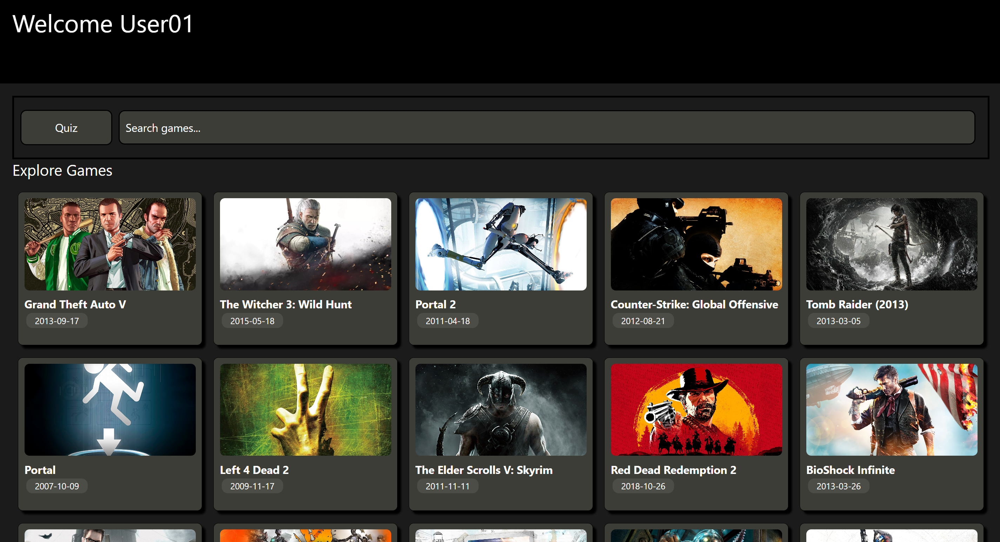
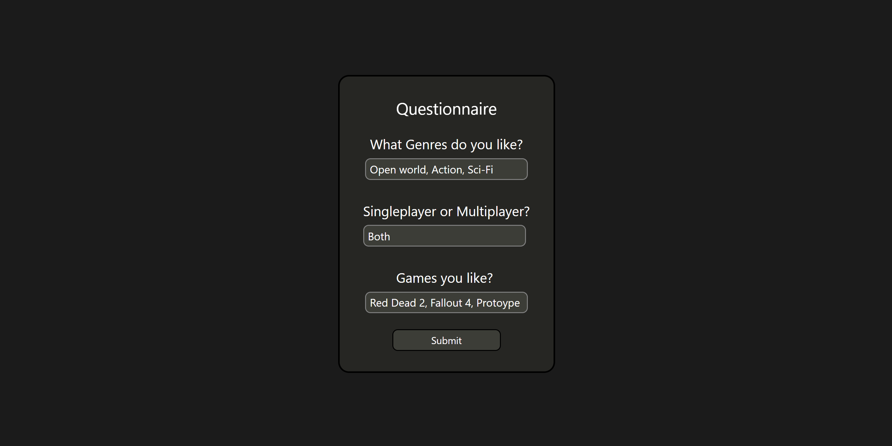
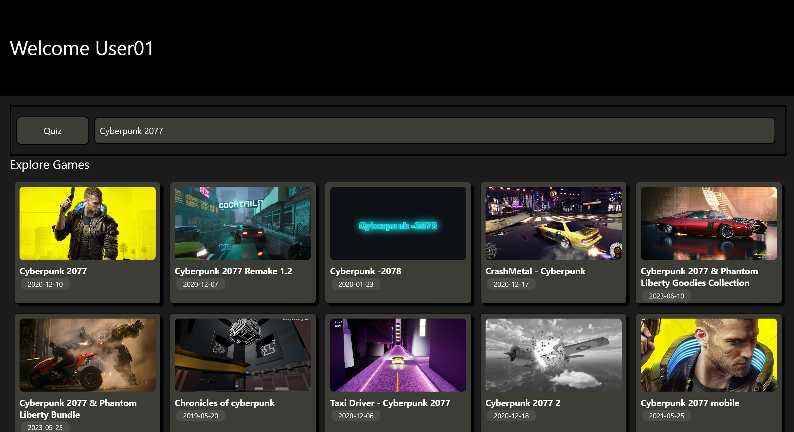
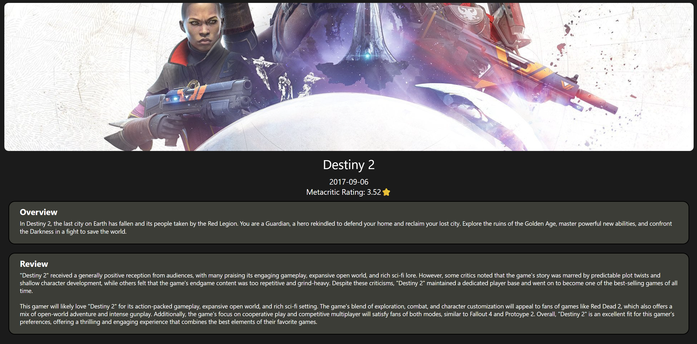

# **AI Game Catalouge: Personalized Game Recommendations Powered by a Local LLM**

## **Project Overview**

The AI Game Catalouge is a React Native mobile application designed as a learning demo to showcase modern development practices. The project solves the problem of generic game discovery by providing users with truly personalized recommendations. It integrates a local Large Language Model (LLM) to analyze a user's unique tastes and generate custom-tailored suitability reviews, moving beyond standard ratings and summaries. The app also serves as a practical example of implementing Redux for robust state management in a mobile environment.

## **✨ Key Features**

  * **🧠 AI-Powered Taste Profile:** Users complete a simple quiz about their gaming preferences, and a local LLM analyzes the responses to create a detailed and nuanced taste profile.
  * **🤖 Custom Suitability Reviews:** For any game in the catalog, the app generates a unique review explaining *why* it is (or isn't) a good match for the user's specific tastes, often comparing it to their favorite games.
  * **🎮 Extensive Game Catalog:** The application fetches and displays a large, searchable library of games from an external API, complete with images and metadata.
  * **✅ Proactive Suggestions:** After the quiz, the app provides an initial game suggestion to guide the user's discovery process.

## **📸 Gallery**

* **Home Page**



* **Taste Profile Quiz**



* **Auto Suggestion**




* **Game Profile with AI tailored reviews**




## **🛠️ Technologies & Tools**

  * **Frontend:** React Native
  * **State Management:** Redux
  * **AI / LLM:** Ollama (Local Instance)
  * **Other Tools:** npm, Metro, Git

## **⚙️ API Integrations**

  * **Game Catalog API** Used to fetch the extensive catalog of games, including titles, release dates, Metacritic ratings, and background images.
  * **Ollama API:** This is the core integration for the AI features. The application communicates with a locally running Ollama server to send quiz results and game data, receiving the generated taste profiles and suitability reviews in return.

## **🚀 Getting Started**

### **Prerequisites**

  * Node.js & npm
  * React Native development environment (Xcode for iOS, Android Studio for Android)
  * A running local instance of [Ollama](https://ollama.com/)

### **Installation**

1.  Install the dependencies:

    ```
    npm install
    ```

### **Running the App**

1.  **Ensure your local Ollama server is running.** You can verify this by opening a new terminal and running `ollama serve`.

2.  Start the Metro bundler:

    ```
    npx expo start
    ```
